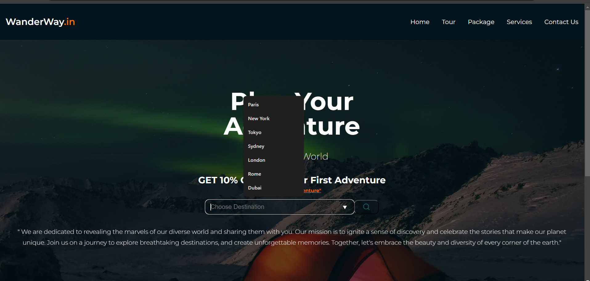
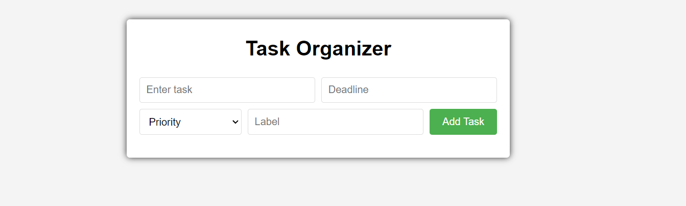
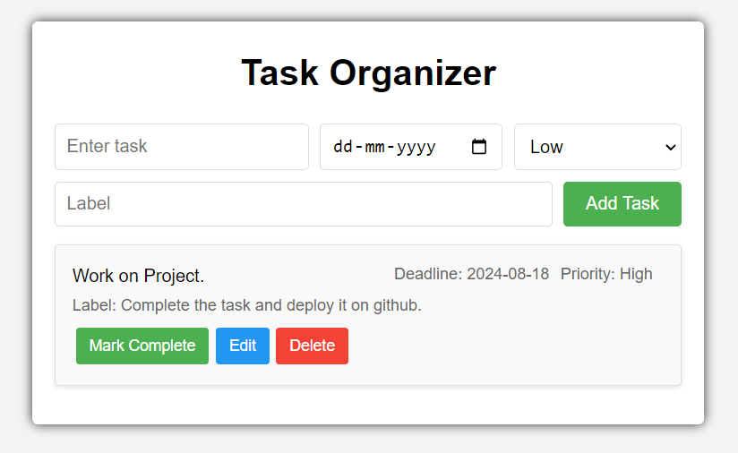
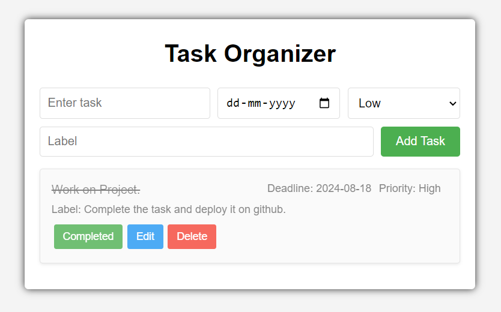
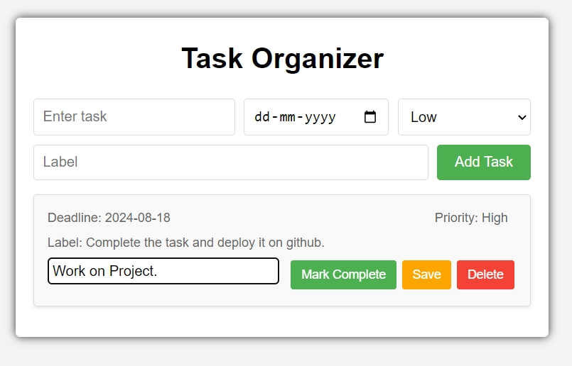

# OctaNet Internship Tasks

Welcome to the repository for my internship tasks at OctaNet Private Limited. This repository will document and showcase the various tasks assigned to me during my internship. Each task will be updated regularly, with detailed descriptions and any relevant code or documentation.

# Task List

# Task 1: Landing Page for Travel Website
# Task Status - Completed

Description:~ 

This task involves creating a landing page for a travel website called WanderWay.in. The landing page is designed to be visually appealing and user-friendly, providing visitors with an overview of the services and offers available. It features a responsive navigation menu, a main section with promotional information, and a footer with social media links.

# Features:~

Responsive Navigation Bar: A navigation bar with links to different sections of the website, including Home, Tour, Package, Blog, and Contact Us.

Promotional Banner: The main section includes a promotional banner that highlights a 10% discount offer for first-time adventurers with the code "FirstAdventure".

Destination Search: An interactive search form where users can choose their desired travel destination from a predefined list.

Company Mission Statement: A brief paragraph that describes the company's dedication to revealing the marvels of the world and encouraging a sense of discovery among travelers.

Footer with Social Media Links: A footer section that includes links to various social media platforms such as Facebook, Twitter, Instagram, and YouTube.

# Technology Stack

HTML: The main HTML file for the landing page.
CSS: The CSS file for styling the landing page.
JavaScript: The JavaScript file for interactive Navbar.

# Screenshots

# Go to Landing Page
cd LandingPage/index.html

# Task 2: To-do List(Task Organizer)
# Task Status - Completed

## Description

This project is a simple and interactive "Task Organizer" web application that allows users to manage their daily tasks efficiently. Users can add new tasks, mark them as completed, edit existing tasks, delete tasks and also user can set priority and deadline for the task. The application is designed with a user-friendly interface, ensuring a seamless experience for managing tasks.

# Features

- Add New Tasks: Users can easily add new tasks to their to-do list.
- Mark Tasks as Completed: Tasks can be marked as completed by clicking on them, helping users track their progress.
- Edit Existing Tasks: Users have the ability to edit the description of tasks if needed.
- Delete Tasks: Unnecessary tasks can be removed from the list with a simple click.
- Persistent Storage: Tasks are stored in the browser's local storage, so they persist even after refreshing the page.

# Technology Stack

- HTML: Provides the structure and content of the web page.
- CSS: Adds styling and layout to make the application visually appealing.
- JavaScript: Implements the functionality and interactivity of the to-do list.

# Usage

- Add tasks by typing in the input field and pressing the "Add" button.
- Click on a task to mark it as completed.
- Edit a task by clicking on the "Edit" button next to it.
- Delete a task by clicking on the "Delete" button.

# Screenshots

# Adding a Task

# Task Marked as Completed

# Editing a Task

# Go to Task Organizer
cd To_Do_List

# Acknowledgements

- Thanks to OctaNet Private Limited for providing the opportunity to work on this project.

